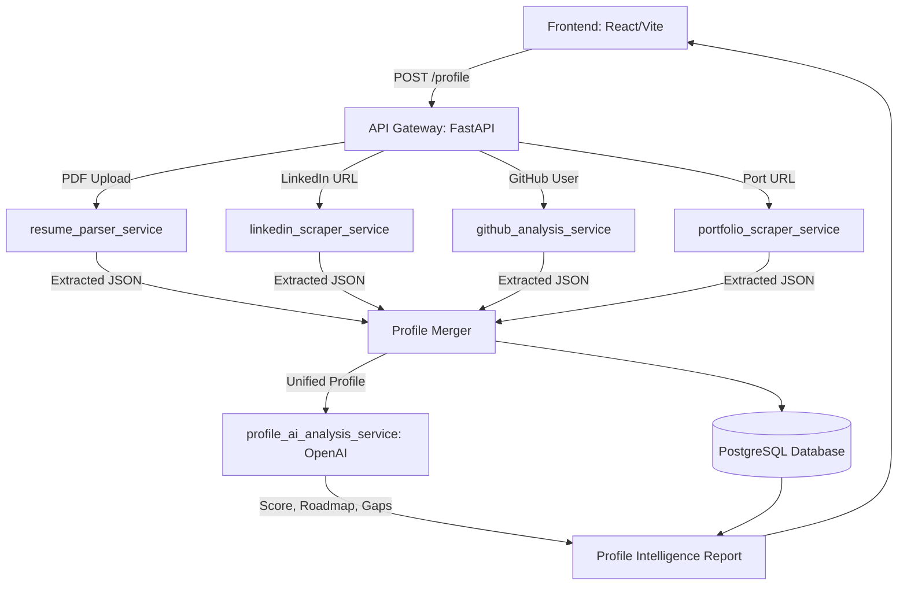

# PAI (Profile Audit Intelligence) System Design

## 2. UI Screens & Navigation Architecture

The PAI module is fully integrated into the global MainLayout. It uses a **Linear Wizard Flow** accessible via a dropdown in the global `Sidebar.tsx`.

### Linear Flow Sequence:
1. **Profile Form (`/pai/profile-form`)**: 6-step manual data entry wizard.
2. **Resume Upload (`/pai/resume-upload`)**: Drag & drop zone with parsing preview.
3. **LinkedIn Import (`/pai/linkedin-import`)**: URL input and data extraction preview.
4. **GitHub Analysis (`/pai/github-analysis`)**: Username input and repository metrics preview.
5. **Portfolio Analysis (`/pai/portfolio-analysis`)**: Website URL input and project extraction preview.
6. **Auditing Screen (`/pai/loading`)**: Simulated data synthesis and AI processing.
7. **Intelligence Report (`/pai/intelligence-report`)**: Final comprehensive evaluation and roadmap.

## 3. Form Schema (Zod / JSON)
```ts
// Unified Profile Object Schema
export const UnifiedProfileSchema = z.object({
  personal: z.object({
    name: z.string(),
    location: z.string(),
    nationality: z.string(),
    languages: z.array(z.string()),
  }),
  academic: z.array(z.object({
    degree: z.string(),
    major: z.string(),
    university: z.string(),
    gpa: z.number(),
    graduationYear: z.number(),
  })),
  testScores: z.object({
    ielts: z.number().optional(),
    toefl: z.number().optional(),
    gre: z.number().optional(),
    gmat: z.number().optional(),
  }),
  experience: z.array(z.object({
    role: z.string(),
    company: z.string(),
    duration: z.string(),
    isInternship: z.boolean(),
  })),
  skills: z.array(z.string()),
  careerGoals: z.object({
    targetCountry: z.string(),
    targetIndustry: z.string(),
    preferredRole: z.string(),
  })
});
```

## 3. Scraping Architecture
- **Tooling**: Playwright for dynamic SPAs (LinkedIn), Scrapy/BeautifulSoup for static portfolios.
- **Service Isolation**: `linkedin_scraper_service` will run in a separate FastAPI worker to avoid blocking the main thread.
- **Evasion**: Uses rotating proxies and stealth plugins (e.g., `playwright-stealth`) to avoid bot detection on LinkedIn.
- **Data Pipeline**: Raw HTML -> Extractor (Regex/Parsers) -> JSON Normalization -> Merge.

## 4. Resume Parsing Pipeline
**Components**:
- `pdfminer.six`: Extracts raw text blocks from the uploaded PDF.
- `PyResparser`: Rules-based extraction of structured fields.
- `spaCy` NER (en_core_web_lg): Extracts nuanced entities like specific technologies, universities, and job titles from the unstructured text.
**Flow**: `PDF -> Text -> PyResparser + spaCy -> Merged JSON`

## 5. AI Analysis Pipeline
**Stack**: OpenAI API (GPT-4o or GPT-4-turbo).
**Input**: Serialized `Unified Student Profile Object`.
**Outputs Generated (JSON)**:
- Profile Strength Score (0-100)
- Skill Gap Analysis (Required vs Current)
- Career Path Recommendations (Top 3)
- Industry Fit & Roadmap
- University Recommendations

## 6. Database Schema (Prisma/SQL)
```prisma
model StudentProfile {
  id              String   @id @default(uuid())
  userId          String   @unique
  personalData    Json
  academicData    Json
  experienceData  Json
  skills          String[]
  unifiedProfile  Json     // Merged output
  analysisReport  Json?    // AI output
  createdAt       DateTime @default(now())
  updatedAt       DateTime @updatedAt
}
```

## 7. Implementation Roadmap
1. **Phase 1: Frontend Structure (Current)**: Build the React UI, form state management, and visualizations matching the EAOverseas theme.
2. **Phase 2: Data Aggregation Engine**: Implement the FastAPI backend services for basic integrations (GitHub API, PDF parsing).
3. **Phase 3: Scraping Services**: Deploy Playwright/Scrapy workers for LinkedIn and Portfolios.
4. **Phase 4: AI & Reporting**: Integrate OpenAI and generate the `Profile Intelligence Report`.
5. **Phase 5: DB & University Matching**: Finalize matching algorithms and save everything to DB.

## 8. System Diagram

